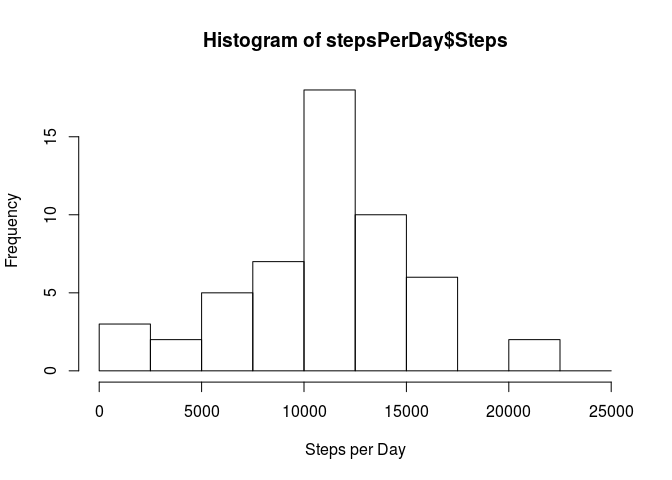
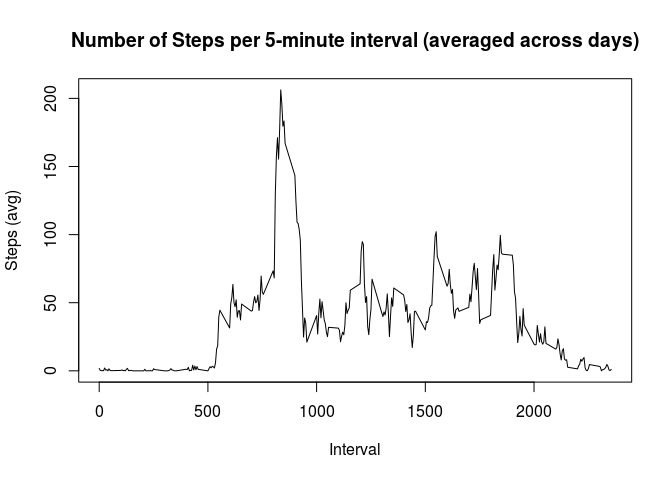
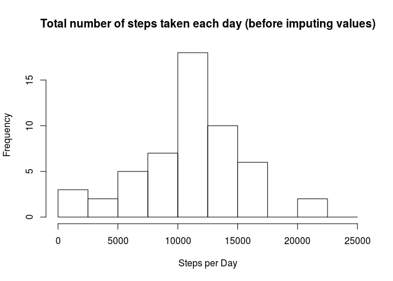
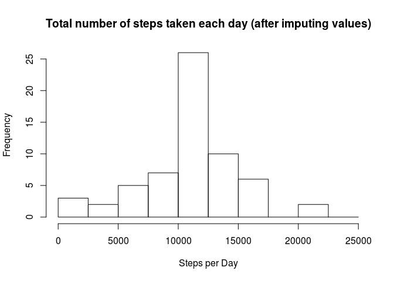

# Loading and preprocessing the data

> Show any code that is needed to
>
> 1. Load the data (i.e. read.csv())


```r
unzip("activity.zip")
activity <- read.csv("activity.csv")
```

> 2. Process/transform the data (if necessary) into a format suitable for your analysis


```r
activity$date <- as.POSIXct(activity$date)
activity$datetime <- as.POSIXct(sprintf("%s %04d",activity$date, activity$interval), format = "%Y-%m-%d %H%M")
head(activity)
```

```
##   steps       date interval            datetime
## 1    NA 2012-10-01        0 2012-10-01 00:00:00
## 2    NA 2012-10-01        5 2012-10-01 00:05:00
## 3    NA 2012-10-01       10 2012-10-01 00:10:00
## 4    NA 2012-10-01       15 2012-10-01 00:15:00
## 5    NA 2012-10-01       20 2012-10-01 00:20:00
## 6    NA 2012-10-01       25 2012-10-01 00:25:00
```


# What is mean total number of steps taken per day?

> For this part of the assignment, you can ignore the missing values in the dataset.
>
> 1. Calculate the total number of steps taken per day


```r
stepsPerDay <- aggregate(x = activity$steps, by = list(activity$date), FUN = sum)
names(stepsPerDay) <- c("Day", "Steps")
```

> 2. If you do not understand the difference between a histogram and a barplot, research the difference between them. Make a histogram of the total number of steps taken each day


```r
hist(
  stepsPerDay$Steps,
  breaks = (0:10)*2500,
  xlab = "Steps per Day",
  ylab = "Frequency"
)
```



> 3. Calculate and report the mean and median of the total number of steps taken per day


```r
library(knitr)
df <- as.data.frame(rbind(
  "Mean" = mean(stepsPerDay$Steps, na.rm = TRUE),
  "Median" = median(stepsPerDay$Steps, na.rm = TRUE)
))
names(df) <- c("Value")
kable(df)
```


|       |    Value|
|:------|--------:|
|Mean   | 10766.19|
|Median | 10765.00|

# What is the average daily activity pattern?

> 1. Make a time series plot (i.e. type = "l") of the 5-minute interval (x-axis) and the average number of steps taken, averaged across all days (y-axis)


```r
stepsPerIntervalAvg <- aggregate(x = activity$steps, by = list(activity$interval), FUN = mean, na.rm = TRUE)
names(stepsPerIntervalAvg) <- c("Interval", "Steps")
plot(
  stepsPerIntervalAvg$Interval,
  stepsPerIntervalAvg$Steps,
  type="l",
  main = "Number of Steps per 5-minute interval (averaged across days)",
  xlab = "Interval",
  ylab = "Steps (avg)"
)
```



> 2. Which 5-minute interval, on average across all the days in the dataset, contains the maximum number of steps?


```r
stepsPerIntervalAvg[stepsPerIntervalAvg$Steps == max(stepsPerIntervalAvg$Steps),]
```

```
##     Interval    Steps
## 104      835 206.1698
```

# Imputing missing values

> Note that there are a number of days/intervals where there are missing values (coded as NA). The presence of missing days may introduce bias into some calculations or summaries of the data.

> 1. Calculate and report the total number of missing values in the dataset (i.e. the total number of rows with NAs)

Before imputing values the total number of missing values in column `steps` is:

```r
# Original dataset
nrow(activity[is.na(activity$steps),])
```

```
## [1] 2304
```

> 2. Devise a strategy for filling in all of the missing values in the dataset. The strategy does not need to be sophisticated. For example, you could use the mean/median for that day, or the mean for that 5-minute interval, etc.

The chosen strategy is to replace NAs in variable `steps` by the average number of steps over the appropriate interval.

> 3. Create a new dataset that is equal to the original dataset but with the missing data filled in.


```r
activityCompleted <- activity
activityCompleted[is.na(activityCompleted$steps),"steps"] <- 
  stepsPerIntervalAvg[stepsPerIntervalAvg == activityCompleted[is.na(activityCompleted$steps),"interval"],2]
head(activityCompleted)
```

```
##       steps       date interval            datetime
## 1 1.7169811 2012-10-01        0 2012-10-01 00:00:00
## 2 0.3396226 2012-10-01        5 2012-10-01 00:05:00
## 3 0.1320755 2012-10-01       10 2012-10-01 00:10:00
## 4 0.1509434 2012-10-01       15 2012-10-01 00:15:00
## 5 0.0754717 2012-10-01       20 2012-10-01 00:20:00
## 6 2.0943396 2012-10-01       25 2012-10-01 00:25:00
```

After imputing values the total number of missing values in column `steps` is:

```r
# new dataset
nrow(activityCompleted[is.na(activityCompleted$steps),])
```

```
## [1] 0
```


> 4. Make a histogram of the total number of steps taken each day and Calculate and report the mean and median total number of steps taken per day. Do these values differ from the estimates from the first part of the assignment? What is the impact of imputing missing data on the estimates of the total daily number of steps?

Once again plot the original data for comparison:

```r
stepsPerDay <- aggregate(x = activity$steps, by = list(activity$date), FUN = sum)
names(stepsPerDay) <- c("Day", "Steps")
hist(
  stepsPerDay$Steps,
  # breaks = (0:10)*2500,
  main = "Total number of steps taken each day (before imputing values)",
  xlab = "Steps per Day",
  ylab = "Frequency"
)
```



Then plot the data with imputed values:

```r
# completed data:
stepsPerDayCompleted <- aggregate(x = activityCompleted$steps, by = list(activityCompleted$date), FUN = sum)
names(stepsPerDayCompleted) <- c("Day", "Steps")
hist(
  stepsPerDayCompleted$Steps,
  # breaks = (0:10)*2500,
  main = "Total number of steps taken each day (after imputing values)",
  xlab = "Steps per Day",
  ylab = "Frequency"
)
```



And finally compute mean and median values:

```r
library(knitr)
df <- as.data.frame(rbind(
  "Mean" = mean(stepsPerDayCompleted$Steps, na.rm = TRUE),
  "Median" = median(stepsPerDayCompleted$Steps, na.rm = TRUE)
))
names(df) <- c("Value")
kable(df)
```


|       |    Value|
|:------|--------:|
|Mean   | 10766.19|
|Median | 10766.19|

The total numbers of steps are increased by the number of NAs times the average number of steps of the interval.

# Are there differences in activity patterns between weekdays and weekends?

> For this part the weekdays() function may be of some help here. Use the dataset with the filled-in missing values for this part.

> 1. Create a new factor variable in the dataset with two levels – “weekday” and “weekend” indicating whether a given date is a weekday or weekend day.


```r
activityCompleted$daytype <- 
  c(rep("weekday",5),rep("weekend",2))[as.numeric(strftime(activityCompleted$date, format="%u"))]
activityCompleted$daytype <- as.factor(activityCompleted$daytype)
str(activityCompleted$daytype)
```

```
##  Factor w/ 2 levels "weekday","weekend": 1 1 1 1 1 1 1 1 1 1 ...
```

> 2. Make a panel plot containing a time series plot (i.e. type = "l") of the 5-minute interval (x-axis) and the average number of steps taken, averaged across all weekday days or weekend days (y-axis). See the README file in the GitHub repository to see an example of what this plot should look like using simulated data.


```r
stepsPerIntervalBydaytype <- with(
  activityCompleted,
  aggregate(x = steps, by = list(interval,daytype), FUN=mean, na.rm = TRUE)
)
names(stepsPerIntervalBydaytype) <- c("interval", "daytype", "steps")
library(ggplot2)
ggplot(stepsPerIntervalBydaytype, aes(interval, steps)) +
  geom_line() +
  xlab("Interval") +
  ylab("Average Number of Steps") +
  facet_grid(daytype ~ .)
```


 
